# FFActions

Version: `1.4.0`

---

# OVERVIEW

FFActions is a Windows tool that adds simple right-click actions to quickly process multimedia files.

It is not meant to replace full editing, encoding, or retouching software. FFActions is designed for fast everyday operations, with simple interfaces and limited settings, so common tasks can be completed without opening a large application or navigating through advanced options.

The general idea is intentionally simple: short dialogs, focused options, and output files created next to the original source file.

---

# HOW IT WORKS

FFActions integrates into the Windows context menu for supported video, audio, and image formats.

Each command launches a standalone tool based on PowerShell and FFmpeg. Every operation creates a new file next to the source file and does not overwrite the original.

For format-based actions such as convert and audio extraction, FFActions now uses small picker windows instead of large nested format submenus. The installer rewires these entries directly to the picker executables so Explorer opens the compact button dialog immediately.

Menu overview:

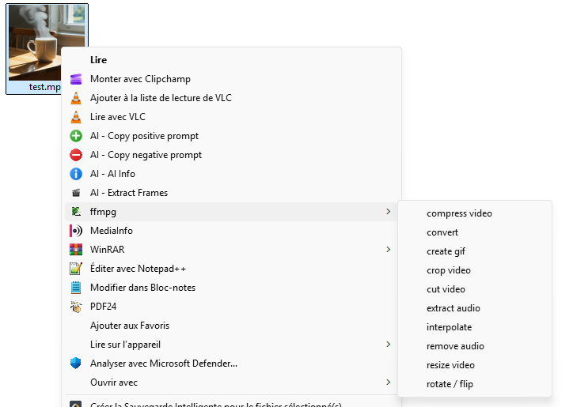
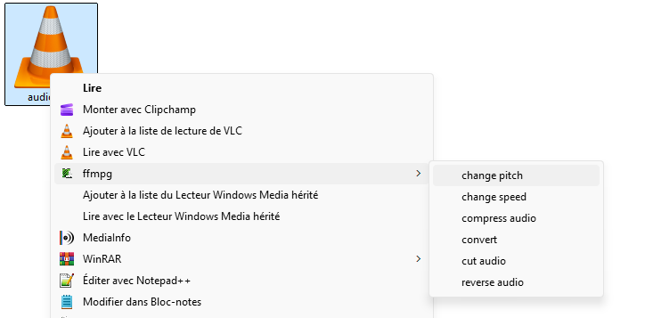
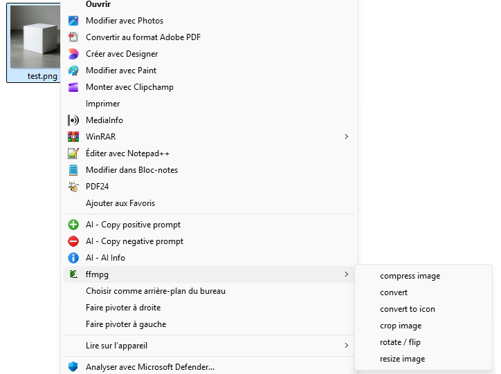

The installer offers these modules:

- Video
- Audio
- Image

## Recent 1.2.2 improvements

- `Cut video` now uses a live preview, a dual-handle timeline, and synchronized frame and time inputs.
- `Rotate / flip image` now uses a visual preview with direct transform buttons and reset.
- `Rotate / flip video` now follows the same visual workflow, with frame preview and slider.
- `Convert video`, `convert audio`, `convert image`, and `extract audio` now use compact centered format pickers with direct-click buttons, wired directly from the installed context menu.
- `Change audio pitch` now includes a slider, synchronized numeric fields, presets, and a 5-second preview.
- `Change audio speed` now uses the same slider-driven workflow, with target duration sync and preview playback.
- `Change video speed` adds the same speed workflow to video files, including video preview generation.
- `Convert to icon` now shows dynamic previews for each selected ICO size.
- The installer now supports same-version maintenance, older-version updates, module changes, and English-only setup text.
- `Compress audio`, `compress image`, `crop video`, and the small picker dialogs received layout fixes for cut text and tighter spacing.
- The project license changed to GNU GPL v3.0.

## Recent 1.3.0 updates

- Added a unified `Media info` action for video, audio, and image files.
- `Media info` now appears at the bottom of FFActions submenus in Explorer.
- Improved WebP compatibility for `Convert to icon`, `Crop image`, `Rotate / flip image`, and `Resize image`.
- Improved user-facing FFmpeg error messages for corrupted or unsupported files.

## Recent 1.4.0 updates

- Added a new visual `Image to PDF` action with page layout editing, crop, rotation, layering, print, and export.
- `Image to PDF` is now the first image action presented in the documentation and the installer image module.
- `Convert video` now includes profile-based conversion presets such as `Universal`, `Remux`, `Montage`, `Web / YouTube`, `Streaming light`, and `TV / USB`.
- `Convert audio` now includes profile presets such as `Standard`, `High quality`, and `Small file`.
- `Create GIF` now provides timeline range selection, frame preview, and looped GIF preview before export.
- `Rotate / flip image` and `Rotate / flip video` now use the updated icon-based transform buttons.
- `Convert to icon` now supports more icon sizes with full-size preview coverage.
- Updated the screenshots for `Image to PDF`, `Create GIF`, `Convert video`, `Convert audio`, `Rotate / flip image`, and `Rotate / flip video`.

---

# VIDEO FEATURES

## Cut Video

Visual cutting tool with a live video preview, a double-handle timeline, and synchronized frame and time fields for precise start and end selection.

Formats: `mp4 mkv avi mov webm m4v`

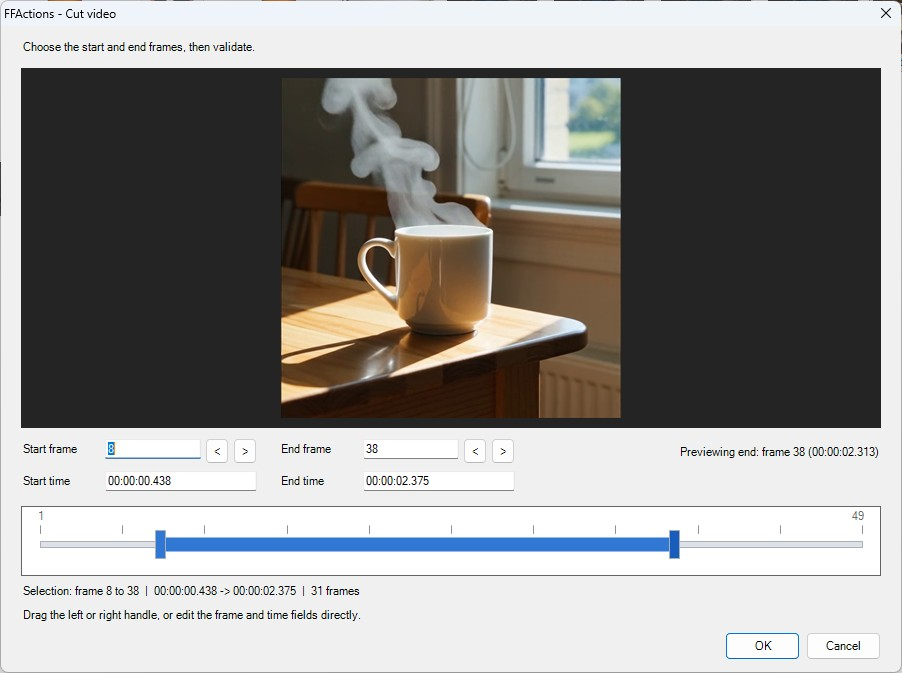

## Interpolate

Increase motion smoothness by generating intermediate frames.

Formats: `mp4 mkv avi mov webm m4v`


## Remove Audio

Remove the audio track from a video.

Formats: `mp4 mkv avi mov webm m4v`

## Extract Audio

Extract the audio track from a video.

The action opens a small centered format picker with direct click buttons, then launches the extraction.

Input formats: `mp4 mkv avi mov webm m4v`

Output formats: `mp3 wav flac m4a ogg`

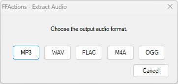

## Create GIF

Create a GIF from a video with visual range selection, frame preview, and a looped GIF preview before export.

Options: drag range handles, live boundary frame preview, GIF preview, resolution presets, FPS presets `8 10 12 15 18 20`, quality presets

Formats: `mp4 mkv avi mov webm m4v`

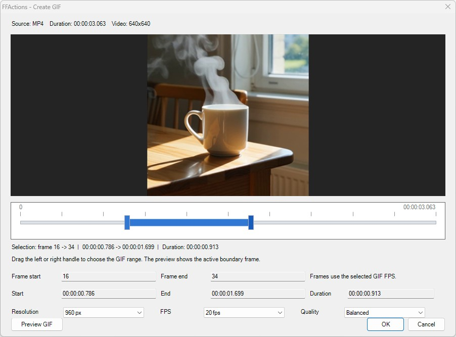

## Resize Video

Resize a video using pixels or percentage.

Options: width/height in px, width/height in %, keep ratio, presets `x0.5 x0.75 x1.5 x2 x4`

Formats: `mp4 mkv avi mov webm m4v`

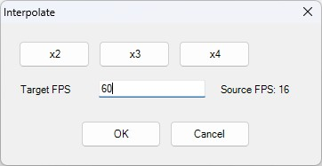

## Change Video Speed

Adjust video playback speed with synchronized percentage, target duration, and slider controls.

Options: percentage, target duration, slider presets, audio pitch preservation, 10-second video preview

Formats: `mp4 mkv avi mov webm m4v`

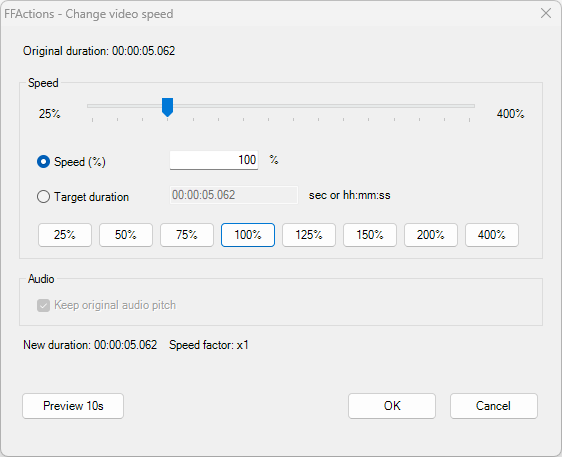

## Crop Video

Visual crop tool with frame preview and a timeline slider to inspect another moment of the video before applying one fixed crop to the full file.

Options: free, square, `16:9`, `9:16`, `4:3`, timeline preview, center, reset

Formats: `mp4 mkv avi mov webm m4v`

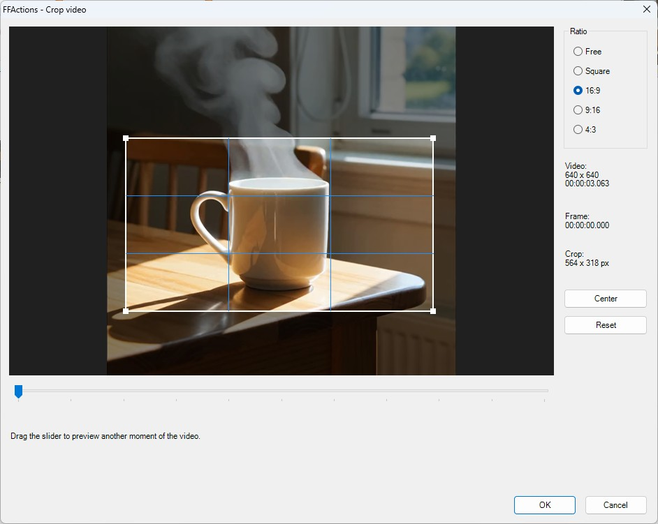

## Rotate / Flip Video

Visual rotate and mirror tool with live frame preview, frame slider, reset button, and direct transform buttons.

Options: rotation left, rotation right, mirror horizontal, mirror vertical

Formats: `mp4 mkv avi mov webm m4v`

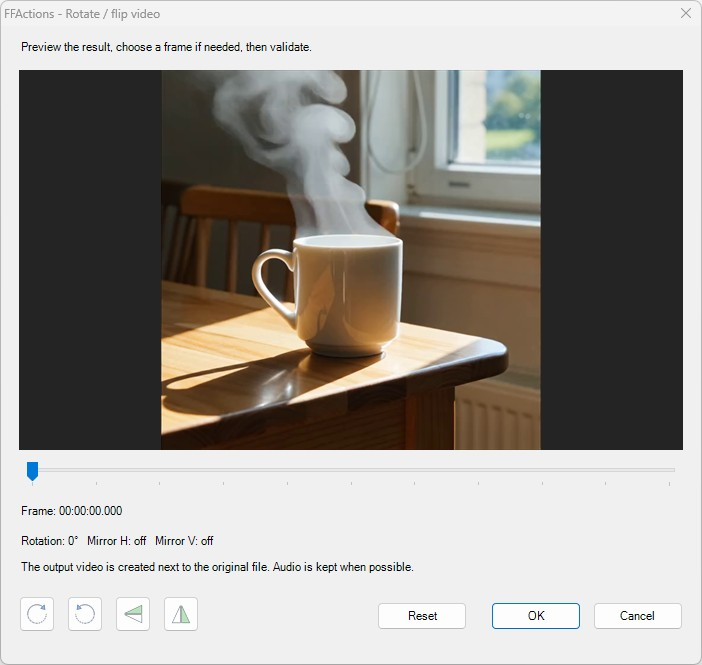

## Compress Video

Compress a video with simple quality presets.

Options: `High quality Balanced Small file`, optional target size

Formats: `mp4 mkv avi mov webm m4v`

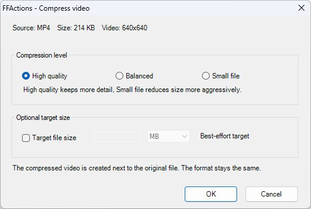

## Media Info

Display key technical metadata for the selected media file (format, duration/size, streams, dimensions, bitrate when available).

Formats: `mp4 mkv avi mov webm m4v` `mp3 wav flac m4a ogg` `png jpg jpeg webp bmp`

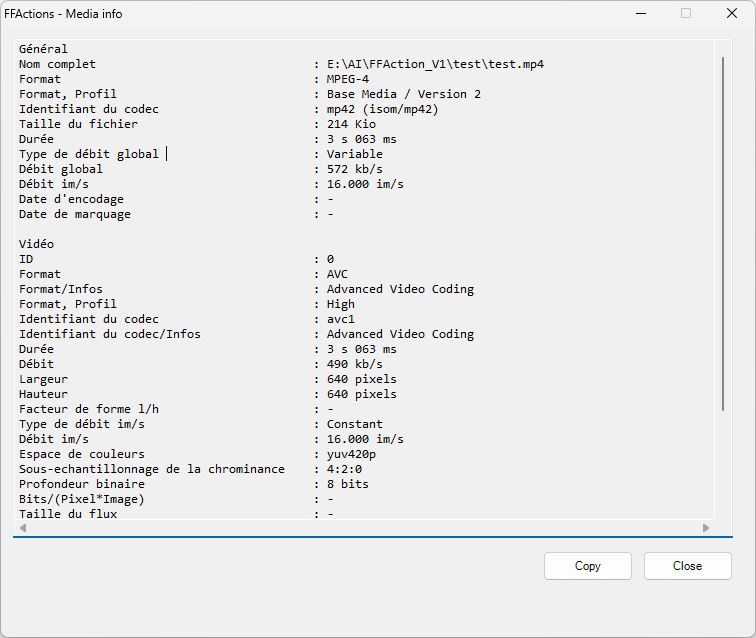

## Convert Video

Convert a video from one format to another.

The action opens a compact format picker with direct click buttons and conversion profiles.

Profiles: `Universal Remux Montage Web / YouTube Streaming light TV / USB`

Input/output formats: `mp4 mkv avi mov webm m4v`

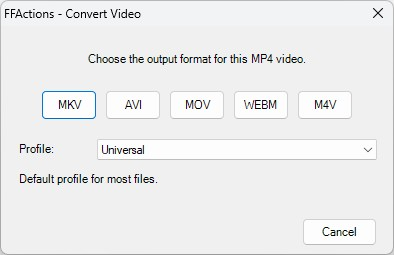

---

# AUDIO FEATURES

## Cut Audio

Quickly trim an audio file.

Formats: `mp3 wav flac m4a ogg`

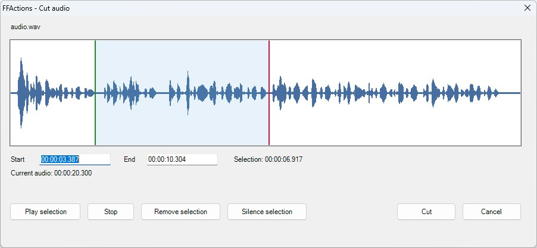

## Convert Audio

Convert an audio file from one format to another.

The action opens a compact format picker with direct click buttons and quality profiles.

Profiles: `Standard High quality Small file`

Input/output formats: `mp3 wav flac m4a ogg`


## Change Speed

Adjust playback speed with synchronized percentage, target duration, and slider controls.

Options: percentage, target duration, slider presets, pitch preservation, 5-second preview

Formats: `mp3 wav flac m4a ogg`

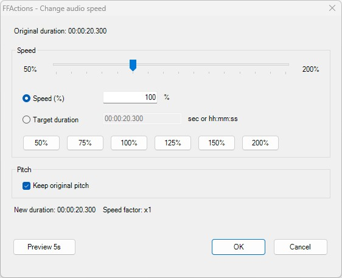

## Change Pitch

Adjust audio pitch with synchronized semitone, percentage, and slider controls.

Options: semitones, percentage, presets, duration preservation, 5-second preview

Formats: `mp3 wav flac m4a ogg`

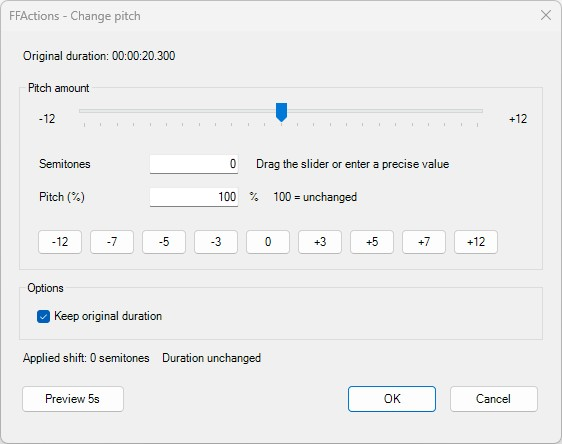

## Reverse Audio

Reverse an audio file so it plays backward.

Formats: `mp3 wav flac m4a ogg`

## Compress Audio

Compress an audio file with simple quality presets.

Options: `High quality Balanced Small file`, optional target size

Formats: `mp3 wav flac m4a ogg`

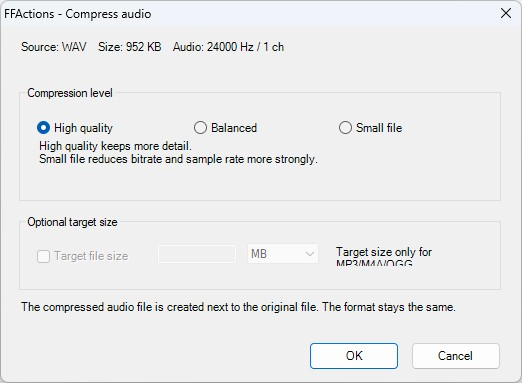

---

# IMAGE FEATURES

## Image to PDF

Create a PDF from one or more images with a visual page layout editor.

Options: add images, move, resize, rotate, crop, layer ordering, `Fit to page`, `Center`, `Print`, `Export`, page sizes `A4 A3 Custom`

Input formats: `png jpg jpeg bmp`

Output formats: `pdf`

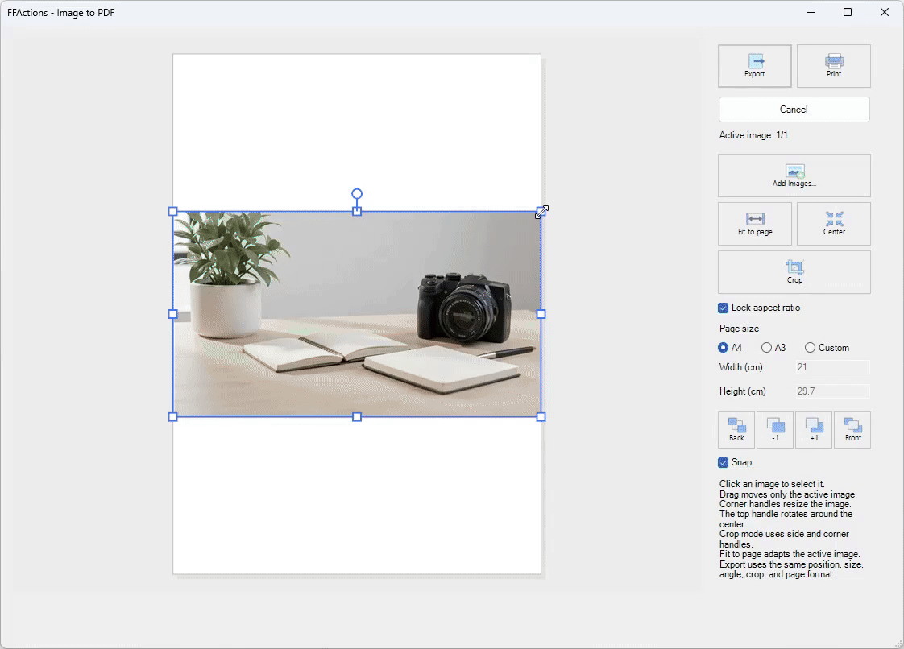

## Resize Image

Resize an image using pixels or percentage.

Options: width/height in px, width/height in %, keep ratio, presets `x0.5 x0.75 x1.5 x2 x4`

Formats: `png jpg jpeg webp bmp`

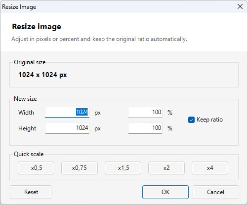

## Convert Image

Convert an image from one format to another.

The action opens a small centered format picker with direct click buttons, then launches the conversion.

Input formats: `png jpg jpeg webp bmp`

Output formats: `png jpg webp bmp`

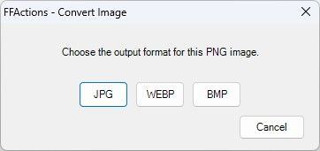

## Compress Image

Compress an image using several quality levels.

Options: `High quality Balanced Small file`, optional target size, output `png jpg webp`

Formats: `png jpg jpeg webp bmp`

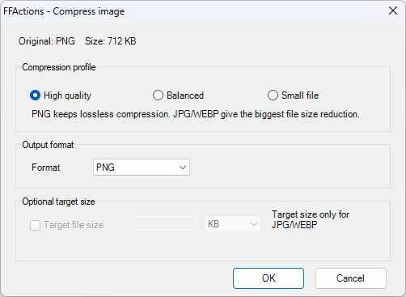

## Rotate / Flip Image

Visual rotate and mirror tool with live preview, reset button, and direct transform buttons.

Options: rotation left, rotation right, mirror horizontal, mirror vertical

Formats: `png jpg jpeg webp bmp`

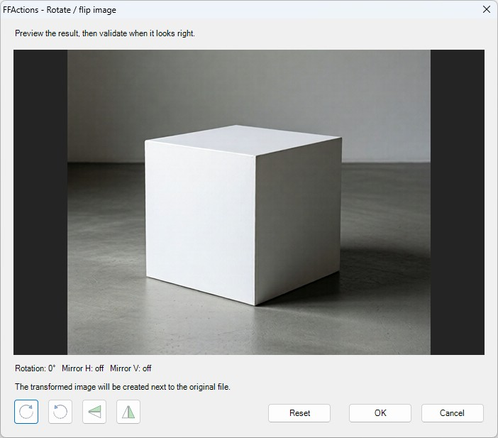

## Crop Image

Visual crop tool with live preview.

Options: free, square, `16:9`, `9:16`, `4:3`, center, reset

Formats: `png jpg jpeg webp bmp`

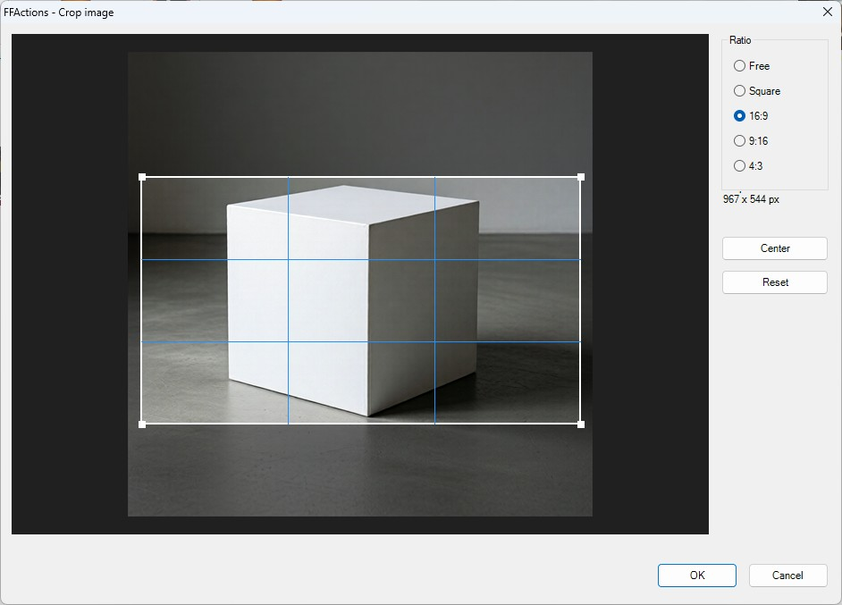

## Convert to Icon

Generate an `.ico` file from an image.

Options: sizes `16 20 24 32 40 48 64 128 256`, modes `Fit Fill`, background `transparent white black`, dynamic size previews

Input formats: `png jpg jpeg webp bmp`

Output formats: `ico`

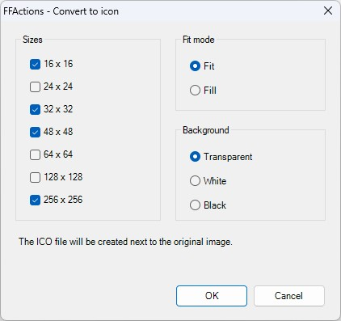

---

# USING THE SCRIPTS WITHOUT THE INSTALLER

This method is useful if you want to review the code, inspect the scripts, or run the tools manually without executing the Windows installer.

## What To Know First

Not every action is stored directly as a final ready-to-run script. A large part of the project is built around:

- template files in `actions\*.template.ps1`
- shared helper files in `actions\_shared\`
- a build script that combines them into usable final scripts

In practice, the flow is:

`template .ps1` -> `generated .ps1 script` -> `manual execution` or `compiled .exe`

## Requirements

Before running any action without the installer, make sure these files exist:

```text
tools/ffmpeg/ffmpeg.exe
tools/ffmpeg/ffprobe.exe
```

You should also open PowerShell in the project root folder, the one that contains `build_all.ps1` and `FFActions.iss`.

## Generate One Script

If you only want to test one feature, you can generate that final script directly from its template.

Example with `resize_image`:

```powershell
powershell -ExecutionPolicy Bypass -File .\actions\build_ffaction.ps1 -TemplateFile .\actions\resize_image.template.ps1 -OutputFile .\actions\resize_image.ps1
```

This command injects the required shared helpers automatically, then produces a final script ready to run.

## Run A Script Manually

Once the final script has been generated, you can launch it directly and pass the file to process as an argument.

Example:

```powershell
powershell -ExecutionPolicy Bypass -STA -File .\actions\resize_image.ps1 "C:\path\to\image.png"
```

The `-STA` mode is important for actions that open a Windows Forms interface.

## Rebuild All Scripts

If you want to rebuild every action in the project at once, use:

```powershell
.\build_all.ps1
```

This regenerates the scripts and can also rebuild the executables if the required build chain is available on the machine.

## Build Requirements

For full local builds, the project expects:

- PowerShell
- `Invoke-PS2EXE` available in the local environment
- Inno Setup for installer builds
- local FFmpeg binaries in `tools/ffmpeg/`

Example to rebuild all local executables:

```powershell
.\build_all.ps1 -Version 1.4.0
```

Example to build the installer after that:

```text
Open FFActions.iss with Inno Setup and compile the installer
```

## If You Never Want To Run The Installer

You can fully work with the project by:

1. reading the templates inside `actions\`
2. generating only the scripts you want to inspect or test
3. running those scripts manually on test files
4. reviewing the FFmpeg commands before execution

In other words, the installer is convenient for Windows right-click integration, but it is not required to audit or use the code.

---

# INSTALLATION

The standard installation uses Inno Setup.

It registers the Windows context menu entries and allows module selection by category:

- Video
- Audio
- Image

Main script:

```text
FFActions.iss
```

Release note:

Compiled installers and generated executables are better distributed through GitHub Releases than committed to the source repository.

---

# LIMITATIONS

FFActions is designed for speed and simplicity.

Advanced codec tuning, fine bitrate control, color profiles, subtitles, complex metadata, multi-track editing, and professional workflows are outside the intended scope of the project.

For advanced or highly precise work, a dedicated tool is a better choice.

---

# DEPENDENCIES

FFActions mainly relies on FFmpeg and FFprobe.

FFmpeg license information:

[https://ffmpeg.org/legal.html](https://ffmpeg.org/legal.html)

---

# LICENSE

FFActions source code is distributed under the GNU General Public License v3.0.

See [LICENSE](LICENSE).

Third-party dependencies keep their own licenses.
